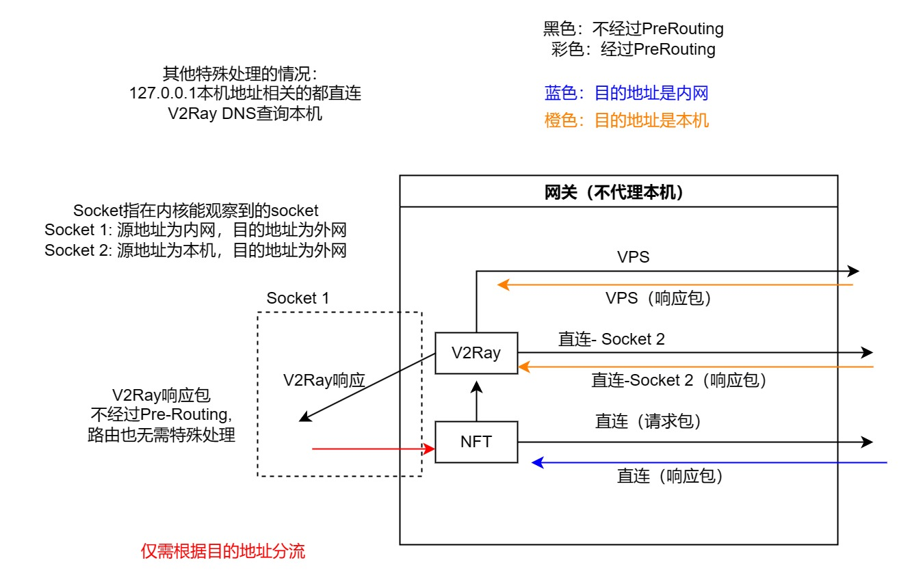

# whitelist transparent proxy

<!-- 本仓库只是展示用，如果有改进我还是在server-management仓库那边维护。本次基于commit -->

完全基于域名列表的白名单透明代理方案，DNS解析后将结果加入一个nftable set后走代理

**优势**

- 完全基于域名白名单进行代理，未知域名不走代理。
  - 最大程度保留原网络的体验。
  - 不会因为透明代理带来额外的负面网络体验。（帕累托优化）
- 使用最新的nftables，而不是iptables。
- 使用高效的nftables ip set分流，直连流量不经过用户态。极大减轻了CPU压力

**不足**

- （目前）不会代理本机（路由器）
- 需要维护一下域名列表，挑选一下走代理的域名。或者遇到走不了的切换socks5代理
- 访问不知名的小网站（不在白名单列表）时可能需要切换一下socks端口，或者手动将其加入白名单列表。

## 架构

- 系统：原版Openwrt(Ubuntu等其他发行版理论上也可以)
- 代理软件：xray
- DNS解析：mosdns
  - 缓存已有DNS结果，让上网的DNS部分的延时几乎为零

## 配置教程

2024年5月13日，基于一个全新安装的 小米 AX6S 路由器，刷原版Openwrt，验证能够正常工作

### 1. 初始配置与安装软件

**换源：**

更换[中科大源](https://mirrors.ustc.edu.cn/help/openwrt.html)：

```bash
sed -i 's/downloads.openwrt.org/mirrors.ustc.edu.cn\/openwrt/g' /etc/opkg/distfeeds.conf
```

**安装软件：**

```
opkg install kmod-nft-tproxy kmod-nf-socket kmod-nft-socket zoneinfo-asia
# 常用工具
opkg install openssh-sftp-server nano curl wget-ssl screen atop htop socat tcpdump unzip
```

**初始配置：**

- 增加网速
- 删除ULA prefix，优化IPv6体验。
- 增加以下系统的备份目录 （System - Backup/Flash Firmware - Configuration）
  - /usr/share/nftables.d/
  - /opt/v2ray/config.json

### 2. 基于策略的路由

前言：由于这里只是新增额外的路由表，不影响默认的路由表，因此不使用透明代理不会产生其他影响。不同网络环境也不需要做出什么修改。

把下面的config加到/etc/config/network里。

```
config rule
        option mark '0x01'
        option lookup '100'

config route
        option interface 'loopback'
        option type 'local'
        option table '100'
        option target '0.0.0.0/0'

config rule6
        option mark '0x01'
        option lookup '106'

config route6
        option interface 'loopback'
        option type 'local'
        option table '106'
        option target '::/0'

config interface 'loopback6'
        option device 'lo'
        option proto 'static'
        list ip6addr '::1'
```

然后`/etc/init.d/network restart`重启网络。

或者GUI里其实也可以一样地操作，效果和上面加config是一样的。

- 新增loopback6接口
- `Network - Routing` 下每个tab都根据上面的config新增对应的规则
  - `IPv4 Rules`：带有标记0x01的都走自定义的路由表100
  - `IPv6 Rules`：带有标记0x01的都走自定义的路由表106
  - `Static IPv4 Routes`：记得选对应的路由表
  - `Static IPv6 Routes`：记得选对应的路由表

### 3. 安装Xray

执行以下命令。但是更换下载链接为设备对应的架构的下载链接。

```bash
mkdir /opt
cd /opt/
wget https://github.com/XTLS/Xray-core/releases/download/v1.8.11/Xray-linux-arm64-v8a.zip
mkdir xray
cd xray
unzip ../Xray-linux-arm64-v8a.zip
```

创建xray服务文件：创建文件`/etc/init.d/xray`，填入以下内容

```bash
#!/bin/sh /etc/rc.common

USE_PROCD=1
START=99

start_service() {
        procd_open_instance
        procd_set_param command /opt/xray/xray run -c /opt/xray/config.json
        procd_set_param limits "nofile=1048576 1048576"
        procd_set_param respawn ${respawn_threshold:-3600} ${respawn_timeout:-5} 0 # ${respawn_retry:-5}
        procd_set_param stdout 1
        procd_set_param stderr 1
        procd_close_instance
}
```

准备xray配置文件，放在`/opt/xray/config.json`。样例配置文件见[tproxy/xrayconfig-sample.jsonc](tproxy\xrayconfig-sample.jsonc)需要注意以下几点：

- outbound连接代理的流量，带上标记255
  ```json
      "streamSettings": {
        "sockopt": {
          "mark": 255
        }
      },
  ```
- 在12345端口准备接收透明代理流量 `dokodemo-door`。不需要开启sniffing，同样给流量标记上255。
- 测试配置文件时，可以手动执行`/opt/xray/xray run -c /opt/xray/config.json`

最后启用xray服务，并测试socks5和http端口能够正常走代理。

```bash
/etc/init.d/xray start
/etc/init.d/xray enable
```

### 4. nftables 规则

前言：由于我们仅对nftset集合内部元素走代理，因此加上时，即使xray和mosdns还没有正常工作，也不会影响正常上网。

- 将`chn_v6.h`文件复制到`/usr/share/nftables.d/ruleset-post/chn_v6.h`（可能需要创建文件夹）
- 将`v2ray.nft`文件复制到`/usr/share/nftables.d/ruleset-post/v2ray.nft`
- 执行`/etc/init.d/firewall restart`。
  - 此时会打印出了`Automatically including '/usr/share/nftables.d/ruleset-post/v2ray.nft'`。

### 5. 安装MosDNS

安装[luci-app-mosdns](https://github.com/sbwml/luci-app-mosdns)。根据教程直接执行：

```
sh -c "$(curl -ksS https://raw.githubusercontent.com/sbwml/luci-app-mosdns/v5/install.sh)"
```

这里我安装的是我修复了一个[bug](https://github.com/IrineSistiana/mosdns/issues/702)的[版本](https://github.com/am009/luci-app-mosdns/actions/runs/8338725563)。在上面安装的基础上，下载对应架构的压缩包，然后解压得到mosdns的ipk文件，安装覆盖。

```bash
# scp copy the ipk to router
opkg install ./mosdns_5.3.1-1_aarch64_cortex-a53.ipk  --force-reinstall
```

根据安装脚本的输出，我的AX6S是aarch64_cortex-a53架构。

- 将这里样例的配置文件夹对应复制到/etc/mosdns，并对应修改配置文件。
- 使用`mosdns start -c /etc/mosdns/config_custom.yaml`命令测试mosdns是否正常运行。
- 创建空白的`/etc/mosdns/hosts.txt`文件
- 在[这里](https://github.com/C502/domain-list-community/releases)下载域名白名单列表：作为 /etc/mosdns/proxy-list.txt 文件。

具体来说，如果想要维护一个自己的域名白名单列表：

- 首先fork一份 v2fly/domain-list-community 然后基于 geolocation-!cn 文件进行修改。然后打包。
- 然后使用我这里fork的[v2dat](https://github.com/C502/v2dat)项目，对上面打包的dat解包，执行`v2dat.exe unpack geosite --nocn .\dlc.dat -o out -f geolocation-!cn`命令得到`out/dlc_geolocation-!cn.txt`文件。这个就可以作为`/etc/mosdns/proxy-list.txt`使用。
- 不用担心域名列表过长，降低mosdns的效率。实测不会有什么影响。

## 原理分析

### nftables规则

基础：

- https://powerdns.org/tproxydoc/tproxy.md.html 唯一讲清楚透明代理的地方。最好先理解伪造源IP的任意源地址socket bind。
- https://blog.fuckgfw233.org/how-tproxy-works/ 
- https://moecm.com/something-about-v2ray-with-tproxy/ 
- [accept时会结束当前table的遍历](https://unix.stackexchange.com/questions/715106/in-nftables-is-the-verdict-statement-accept-final-or-not)
- https://upload.wikimedia.org/wikipedia/commons/3/37/Netfilter-packet-flow.svg



如果从IPv4，内网都是内网专用地址的角度看，那么IPv6就不太一样，事情变得复杂。

1. 包从外面来，根据nft表规则，走到最下面的时候标上1，
  DNS包
  1. 目的地址是网关v4的，应该被劫走
  2. v2ray根据需要发起请求。本机代理查询dns。
  3. v2ray响应dns，直接放行。
  其他包
  4. 如果没有走到最下面，则直接正常转发走了。
  5. 响应包回来，目的IP是内网的包。应该直接放行。
2. 由于标了1，进到那边加的带1的路由表，被路由到lo网卡，进v2ray里面
3. v2ray选择直连或者代理。如果是走代理，会标0xff，直接出去。
  1. 响应的包的源IP是国外，目的IP是本机。应该直接放行。
4. 如果直连，也会标上0xff，直接出去。
  1. 响应的包的源IP可能国内可能国外，目的IP也是本机，应该直接放行。
5. 在 OUTPUT 链打标记会使相应的包重路由到 PREROUTING 链上

推论：
1. 由于必须要路由表配合，所以必须放到prerouting。
2. v2ray出来的包（基本都）可以直接假设走掉了（通过0xff），不用管
3. v2ray直连、转发的包的响应包，目的地址是本机，
  1. 另外v2ray回来的包是直接从v2ray那边出来，所以不会过prerouting，规则只需要匹配入的包。之前写得好像不对？
  2. 其他回来的包也会走prerouting。。。但是这种包一般target地址都是本机的。所以要放行本机（最好以及dhcp的网段？）
4. 旁路由要透明代理一定要防火墙里允许input。
IPv6
1. 透明代理也是一种代理，代理了即使是直连，也会导致ip变成网关ip,类似于NAT，外面无法直连进来。
2. 如果考虑udp，则无法区分内部访问外面，外面发回的响应包，和外面直连内部的包。
3. 想要支持直连，必须在nft规则里让想要直连的整个区域写规则不进v2ray。

2022年11月16日 DNS问题。v2ray规则要把局域网direct，然后规则里放行DNS响应，src port 53。（好像是那次CPU占用100的死循环？）

### 基于策略的路由

Policy based routing table 基于策略的路由表规则。这个是所有透明代理都有的部分。这里和其他透明代理在这一块也没有区别。

- **原因**：tproxy指定socket不够，还要配路由表才能让tproxy的包能进input链，从而发给xray/v2ray。
  - 那边nft规则，决定一个包走tproxy的时候还要标上1标记。
  - 这里使用基于策略的路由，将带有标记1的包全都走特殊的路由表100，然后路由表里把所有包走本地设备lo。
- **理论简介**： 路由表并不是只有一个。其实在路由表之前会根据策略选择不同的路由表。使用ip rule list可以查看，其中优先级越低则越优先。其中lo的本地回环路由表的优先级为0，最高。其次才是main 和default。其中路由规则默认会加入到main。

常用命令如下：
```bash
# 查看policy based routing 规则：ip [-6] rule list
ip route list table 100
# 查看policy based routing 路由表：ip [-6] route list table xxx
ip -6 route list table 106

# 创建新路由表
echo 200 custom >> /etc/iproute2/rt_tables
ip rule add from <source address> lookup <table name>
ip route add default via 192.168.30.1 dev eth1 table custom
# 检测路由规则
ip route get 4.3.2.1 from 10.10.20.253 iif eth0
```

### MosDNS

- https://irine-sistiana.gitbook.io/mosdns-wiki/mosdns-v5/ru-he-pei-zhi-mosdns/sequence-cha-jian 插件文档
- https://github.com/sbwml/luci-app-mosdns
- 透明代理DNS当前规划：由mosdns查询国外域名的同时，把相关段加入到nftables的set中。
- 注意一定要加logfile。不然会报错。如果无法启动，优先查自己的配置文件。
- https://www.v2ex.com/t/915539 这里看到的
- https://github.com/IrineSistiana/mosdns/discussions/605 一个分流的例子
- https://github.com/sbwml/luci-app-mosdns 

#### 缓存问题

查缓存的问题是，不知道是否要更新nft-set。如果一个域名的TTL很长，几天，导致缓存总是命中，而nftables里面的规则已经expired了，就会出现问题。

由于有 查国外的之后判断是否是国内地址 的逻辑，什么时候cache就变得很微妙。

### Openwrt 规则持久化

- 增加配置，指定nft文件路径
- 或者直接将配置放到/usr/share/nftables.d/ruleset-post/
  - https://openwrt.org/docs/guide-user/firewall/firewall_configuration#includes_for_2203_and_later_with_fw4 

最开始，防火墙restart的时候不会删旧的规则。每次重启v2ray规则就会多一份（见[这里](https://forum.openwrt.org/t/help-me-update-my-hfsc-shaper-scripts-for-fw4-nftables/135594/116)）。但是，规则文件前面类似这样写，每次刷新一下table，就可以了：

```
table ip v2ray
flush table ip v2ray
```
